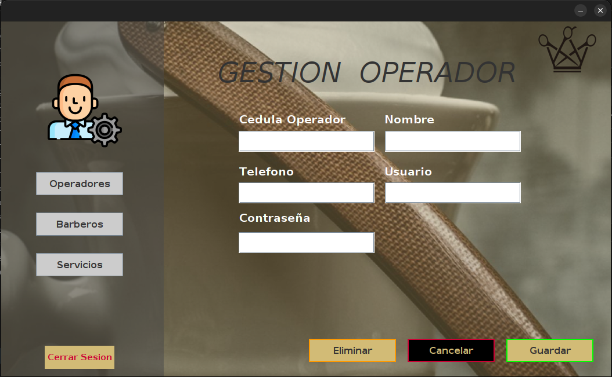
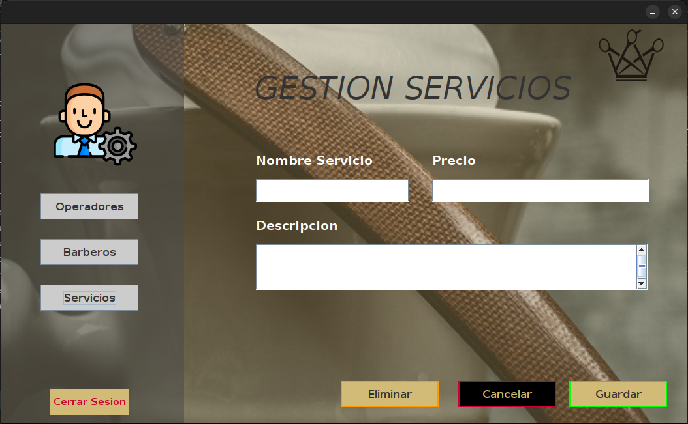

# KingsBarbershop   ¡Tu Estilo, Tu Reino!

**KingsBarbershop** es una aplicación de escritorio desarrollada en Java que facilita la gestión de una barbería. Con esta herramienta, puedes organizar a tus empleados, clientes, citas y reservas, proporcionando el orden necesario para tu negocio de barbería.

## ¿Cómo funciona?

### LogIn
tene mos dos perfiles de ingreso
1. Administrador (usuario y contraseña predeterminado)
2. Operador (cuenta creada por el administrador)

### Login Administrador
usted podra ingresar como administrador para gestionar servicios, barberos y operadores (empleados que administran la app)
- Crea un operador en la ventana **Operadores** ingresando su informacion y presionando el boton **Guardar**. Eliminalos ingresando la informacion y presionando **Eliminar**

- En la ventana **Barberos** podrás crear un nuevo barbero ingresando la información y presionando **Guardar**, o ingresa la cédula de un barbero existente y elimínalo con el botón **Eliminar**.

- Crea un servicio en la ventana **Servicios**, ingresa la informacion y presiona **Guardar**.Eliminalos ingresando la informacion y presionando **Eliminar**

### Login Administrador
podras administrar la app de forma funcional (solo funcionalidades de agendar y administrar barberos), permitiendote: 

### Crear Cita

En la ventana **Citas** podrás crear una nueva cita . Solo ingresa la información del nuevo cliente, la informacion de la cita y presiona el botón **Guardar**. ¡Así de sencillo!

### Ver Reservas

En la ventana **Reservas** podrás ver cada una de las citas agendadas con su respectiva información.
(t = reserva activa, f= reserva inactiva)

## Instalación

1. Clona este repositorio.
2. Abre la aplicación en NetBeans o cualquier IDE que permita Java.

(Ten en cuenta que debes contar con un JDK en las ultimas versiones.)

## Base de datos

Todo el manejo de datos se hace usando el sistema o motor de bases de datos relacional **PostgreSQL**, donde te garantizamos una buena seguridad y respaldo de toda la información.

Tablas: 
- barbers
- clients
- reservations
- users
- services

Estas tablas se usan de manera Relacional, para un mejor tratamiento de datos y sobre todo, garantizar la persistencia de datos.

## Uso

Solo presiona el botón de **RUN** de tu IDE y ya podrás disfrutar de KingsBarbershop.

## Contacto

Cualquier problema o inquietud contáctame por correo electrónico:

samuelzapatam1@gmail.com

Estaré pendiente de cualquier duda, aporte y/o consejo. Muchas gracias y disfruta KingsBarbershop.
