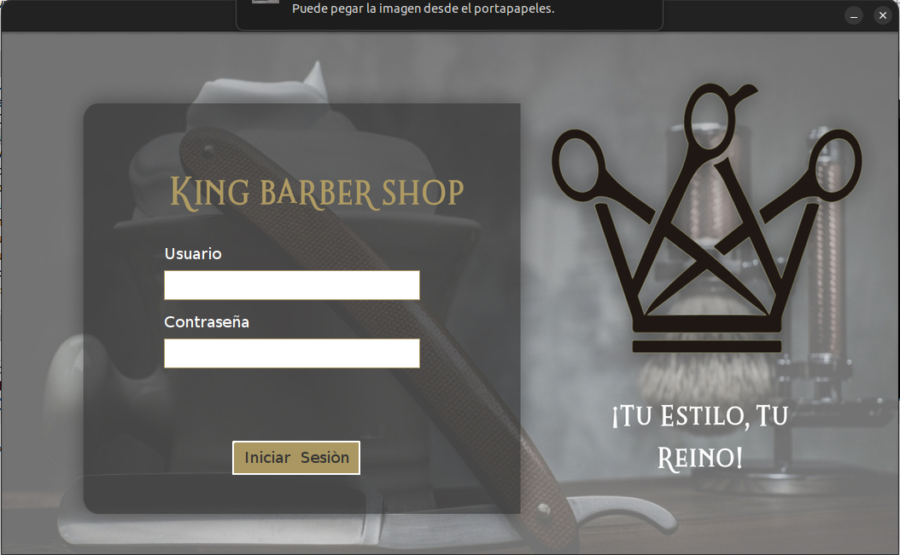
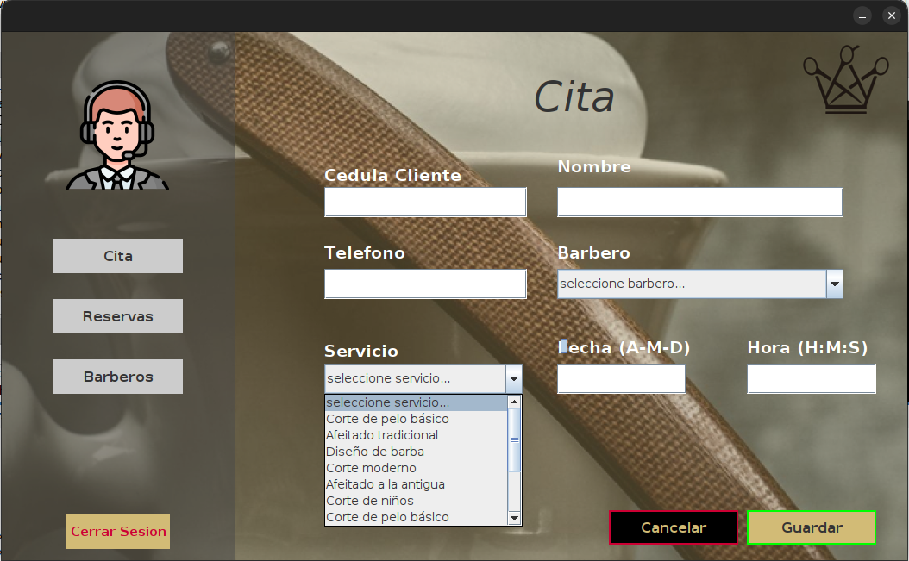
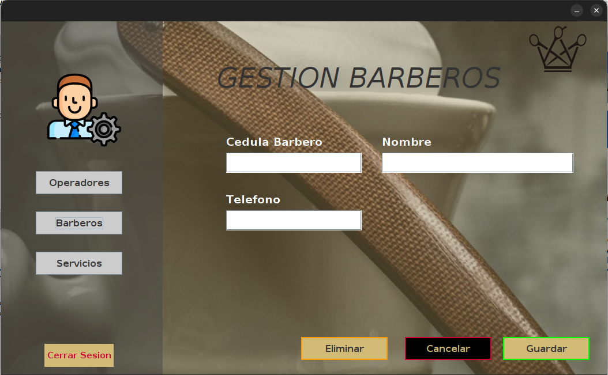
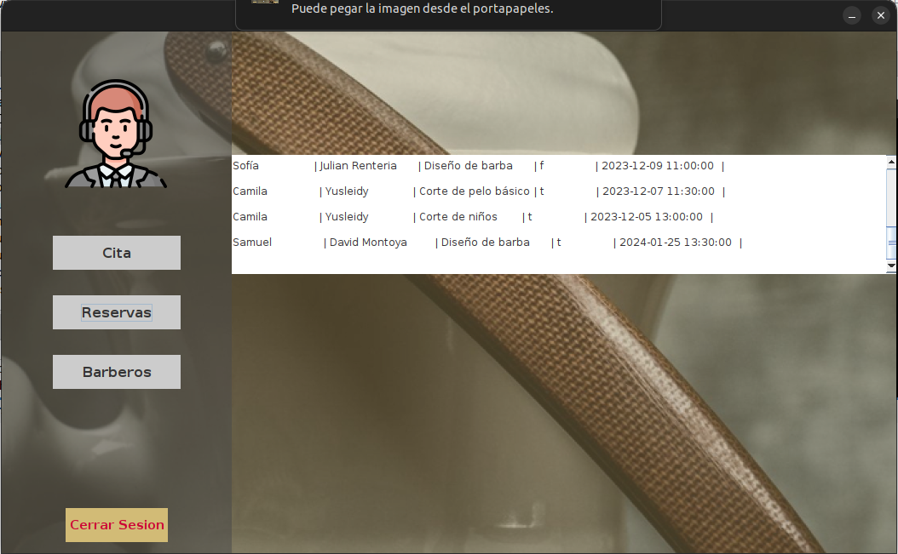

# KingsBarbershop

**KingsBarbershop** es una aplicación de escritorio desarrollada en Java que facilita la gestión de una barbería. Con esta herramienta, puedes organizar a tus empleados, clientes, citas y reservas, proporcionando el orden necesario para tu negocio de barbería.

## ¿Cómo funciona?

### LogIn
Accede predeterminadamente con usuario: **codigoc13** y contraseña: **1234**, luego podrás crear un operador, que será tu nueva cuenta a partir de ese momento.

### Crear Cita

En la ventana **Citas** podrás crear un nuevo cliente. Solo ingresa la información del nuevo cliente y presiona el botón **Guardar**. ¡Así de sencillo!

### Crear Barbero

En la ventana **Barberos** podrás crear un nuevo barbero ingresando la información y presionando **Guardar**, o ingresa la cédula de un barbero existente y elimínalo con el botón **Eliminar**.

### Ver Reservas

En la ventana **Reservas** podrás ver cada una de las citas agendadas con su respectiva información.

## Instalación

1. Clona este repositorio.
2. Abre la aplicación en NetBeans o cualquier IDE que permita Java.

(Ten en cuenta que debes contar con un JDK en las ultimas versiones.)

## Base de datos

Todo el manejo de datos se hace usando el sistema o motor de bases de datos relacional **PostgreSQL**, donde te garantizamos una buena seguridad y respaldo de toda la información.

## Uso

Solo presiona el botón de **RUN** de tu IDE y ya podrás disfrutar de KingsBarbershop.

## Contacto

Cualquier problema o inquietud contáctame por correo electrónico:

samuelzapatam1@gmail.com

Estaré pendiente de cualquier duda, aporte y/o consejo. Muchas gracias y disfruta KingsBarbershop.
